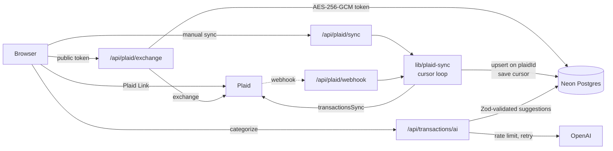

# Photon Trail

A personal-finance pipeline: link bank accounts through Plaid, sync transactions into Postgres with cursor-based incremental sync, and get AI category suggestions with confidence scores.

[](#status)


## What it does

- Google sign-in through NextAuth with database-backed sessions (Drizzle adapter).
- Plaid Link flow: the server creates the link token and exchanges the public token; the Plaid access token never reaches the client and is stored encrypted.
- Incremental transaction sync with Plaid's `/transactions/sync` cursor, triggered by the user or by a Plaid webhook.
- AI categorization: batches of transactions go to OpenAI, the JSON response is validated with Zod, and suggestions are stored with a confidence score and the model name.
- Dashboard with summary cards, category breakdown, timeline, filters, and inline manual category overrides.

## How it works



Mechanisms in the code:

- **Idempotent ingestion.** Transactions are upserted on a unique `plaidId`, so replaying a sync page or receiving a duplicate webhook updates rows instead of duplicating them. Removed transactions are soft-marked `status = 'removed'`.
- **Cursor checkpointing.** The sync loop pages with `count: 100` until `has_more` is false, then stores `next_cursor` and `lastSyncedAt` on the Plaid item so the next run resumes from there (`lib/plaid-sync.ts`).
- **Secrets at rest.** Plaid access tokens are encrypted with AES-256-GCM using a key derived via scrypt from `PLAID_ENCRYPTION_KEY` (`lib/crypto.ts`).
- **Retries with backoff.** OpenAI calls retry up to 3 times on 429 and 5xx responses, doubling from 500 ms (`lib/ai.ts`).
- **Rate limiting.** AI categorization is limited per user per minute (`AI_RATE_LIMIT_PER_MINUTE`, default 6) and returns `429` with `Retry-After` (`lib/rate-limit.ts`). The limiter is in-memory, so it is per instance.
- **Validation at the boundary.** Request bodies and model output are parsed with Zod before anything is written, and AI suggestions are applied only to transaction ids owned by the signed-in user.
- **Auth on every data route.** API routes check the NextAuth session; the Plaid webhook checks an optional shared secret.
- **Schema and migrations.** Drizzle schema in `db/schema.ts`, generated SQL migrations in `drizzle/`, indexes on `(userId, postedAt)` and `(userId, category)`.

Data model: `users`, `accounts`, `sessions`, `verificationTokens` (auth), `plaidItems` (encrypted token, cursor, sync status), `transactions` (amount, merchant, Plaid category, `aiCategory`, `aiConfidence`, `manualCategory`), and `aiCategorySuggestions` (category, confidence, rationale, model, raw suggestion).

## Getting started

Requires Node.js 20+, a Postgres database (Neon or local) and Plaid sandbox keys. OpenAI is optional.

```bash
git clone https://github.com/NaxeCode/Photon-Trail.git
cd Photon-Trail
npm install
cp .env.example .env.local   # DATABASE_URL, NEXTAUTH_*, GOOGLE_*, PLAID_*, PLAID_ENCRYPTION_KEY, OPENAI_API_KEY
npm run db:migrate
npm run db:seed
npm run dev                  # http://localhost:3000
```

Other scripts: `npm run db:generate` (after schema changes), `npm run db:studio`, `npm test` (Vitest), `npm run lint`.

## Status

Work in progress. Auth, Plaid linking, cursor sync, encrypted token storage and AI categorization are implemented, with Vitest coverage for the validators and the AI route. Sync runs inline in the request or webhook handler rather than in a background worker, the Plaid webhook uses a shared-secret query parameter rather than Plaid's signed JWT verification, and there is no public deployment yet.

---
<sub>Built by [Aladdin Ali](https://github.com/NaxeCode) · [naxecode.github.io](https://naxecode.github.io)</sub>
